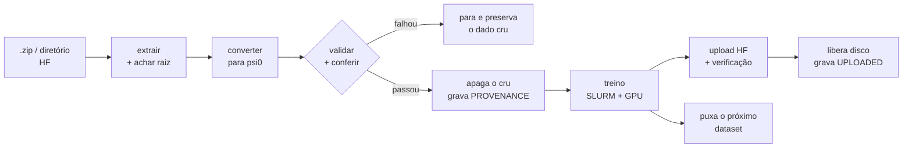

# Pipeline de fine-tuning GR00T-N1.7

Do `.zip` bruto ao modelo publicado no Hugging Face, sem passo manual no meio.

O pipeline faz cinco coisas em sequência, para vários datasets, sem supervisão:



A regra que atravessa tudo: **nada é apagado antes de existir prova de que o sucessor está
íntegro.** O dado cru só some depois que a conversão passa na validação; o checkpoint só
some depois que o upload é conferido arquivo por arquivo contra o repositório remoto.

---

## Por que ele existe

Cada etapa aqui foi escrita depois de um erro real. Vale saber quais, porque explicam
decisões que parecem excesso de zelo:

| Modo de falha | O que o pipeline faz |
|---|---|
| `modality.json` copiado de outro dataset: o treino roda, a loss cai, o modelo é inútil no deploy | Gera a partir dos dados e **valida**; nunca herda |
| Assumir que todo `.zip` tem a mesma estrutura | Procura `meta/info.json`, nunca monta o caminho |
| Dois arquivos internos que descompactam para o mesmo lugar (um sobrescreve o outro em silêncio) | Cada arquivo aninhado extrai no seu próprio diretório |
| Conversor que trunca em 99 episódios por padrão | Passa a contagem real lida do `info.json` |
| Apagar checkpoint após um upload que falhou pela metade | Confere nome e tamanho de cada arquivo no remoto antes de apagar |
| Estourar a cota de disco às 7 h de treino | Barra o job antes de alocar GPU se a folga for insuficiente |
| Encher a fila do SLURM e travar o cluster para os colegas | Mantém N jobs rodando e **zero** pendentes |

---

## Instalação numa máquina nova

Cinco coisas precisam existir antes do primeiro treino. Só a primeira vem do git.

### 1. O repositório, com submódulos

O conversor mora num submódulo. Clonar sem ele deixa o pipeline sem como converter nada.

```bash
git clone --recurse-submodules git@github.com:AKCIT-RL/Psi0.git
cd Psi0

# se já clonou sem --recurse-submodules:
git submodule update --init --recursive
```

Confira que veio o commit certo — o pipeline depende de correções que estão num branch
específico do `SIMPLE`:

```bash
git submodule status
#  6ef0b86... third_party/SIMPLE (heads/fix/modality-and-torso-feedback)
```

### 2. O venv do gr00t

Os scripts de preparo e upload rodam **nativos**, fora do container: precisam só de
`numpy`, `pandas`, `pyarrow`, `tqdm` e `huggingface_hub`.

```bash
cd src/gr00t
uv venv .venv-gr00t --python 3.12          # CUDA 13; use --python 3.10 para CUDA 12
source .venv-gr00t/bin/activate
uv sync --active --extra cuda13            # ou --extra cuda12
cd ../..

src/gr00t/.venv-gr00t/bin/python -c "import pandas, pyarrow, huggingface_hub; print('ok')"
```

O `README.md` na raiz documenta as duas variantes com mais detalhe. O que importa aqui é
que o venv fique em `src/gr00t/.venv-gr00t`.

O caminho `src/gr00t/.venv-gr00t/bin/python` está no default de todos os scripts. Se o seu
venv ficar noutro lugar, exporte `PY=/caminho/para/python`.

### 3. A imagem Apptainer

O treino roda dentro dela. Não vai no git (vários GB):

```bash
docker build -t psi0-train -f docker/Dockerfile .
apptainer build industrial_humanoids_psi0-train.gr00t_devel.sif docker-daemon://psi0-train:latest
```

Ou copie o `.sif` de uma máquina que já o tenha. Se usar outro nome, exporte `SIF_PATH`.

### 4. O modelo base

`checkpoints/GR00T-N1.7-3B/` (~6,5 GB) — copie de uma máquina existente ou peça ao time.
Não está em repositório público. O treino aborta com erro claro se faltar.

### 5. O `.env`

```bash
cp .env.sample .env
```

Preencha, no mínimo:

```
HF_TOKEN=hf_...          # precisa ser token de ESCRITA, senão o upload falha no fim
WANDB_API_KEY=...
```

O upload confere o escopo do token logo no início e recusa um token de leitura antes de
gastar tempo subindo nada.

### Verificação

```bash
./run_pipeline.sh --dry-run
```

Mostra o plano sem submeter. Se chegar até a tabela de datasets, o setup está completo.

---

## Uso diário

### Preparar datasets

De `.zip` numa pasta:

```bash
PY=src/gr00t/.venv-gr00t/bin/python

$PY scripts/prepare_simple_datasets.py --list      # o que cada arquivo contém
$PY scripts/prepare_simple_datasets.py             # prepara tudo que falta
```

De um diretório já extraído (por exemplo baixado do Hub):

```bash
$PY scripts/prepare_simple_datasets.py --from-dir data/simple/simple-teleop/MeuDataset
```

Diferença importante: com `--from-dir` o **diretório de origem nunca é apagado**, porque
não há arquivo compactado de onde restaurá-lo.

Cada dataset pronto ganha um `PROVENANCE.json` com a origem, o sha256, o schema detectado,
o conversor usado e as medições da conferência física. Sem esse arquivo, o
`run_pipeline.sh` ignora o diretório: um dataset cuja procedência não foi registrada não
entra em treino automaticamente.

### Rodar o pipeline

```bash
./run_pipeline.sh                  # 2 datasets por vez, o resto fora da fila
./run_pipeline.sh --max-inflight 3
./run_pipeline.sh --serial         # um de cada vez
./run_pipeline.sh --status         # o que treina, o que já foi publicado
./run_pipeline.sh --stop           # termina os atuais e não puxa mais nada
./run_pipeline.sh --resume
```

### Rodar um dataset isolado

Fora do pipeline, sem puxar mais nada:

```bash
# treina e publica ao terminar
sbatch --export=ALL,DATASET_NAME=<nome>,PIPELINE_UPLOAD=1 submit_slurm.sh

# treina e para; você publica quando quiser
sbatch --export=ALL,DATASET_NAME=<nome> submit_slurm.sh
sbatch --export=ALL,RUN_NAME=gr00t_n1d7_finetune_output_<slug> submit_upload_slurm.sh
```

Para o pipeline não pegar um dataset que você quer tocar à mão:

```bash
mkdir -p .pipeline/claims/<nome-do-dataset>
```

---

## Como funciona por dentro

### O portão de preparo

O gerador detecta o schema e o pipeline decide o caminho:

| `detected schema` | O que acontece |
|---|---|
| `psi0 (states=32, action=36)` | já treinável: move para `simple-converted/`, regera o `modality.json`, valida |
| `raw whole-body teleop (43 dof)` | converte com `postprocess_psi0_teleop_wbc.py` (ou `_sonic.py`) |
| `unknown (...)` | **para**, preserva o cru, não escreve nada |

Depois disso, dois portões obrigatórios:

1. `validate_lerobot_modality.py --expect-psi0` precisa sair com `exit=0`
2. Conferência física: dimensões 36/32, sem NaN, `state.height[t] == action.height[t-1]`
   por episódio, altura do tronco em faixa plausível

A conferência distingue **erro de conversão** de **episódio estranho**: um erro de
conversão desloca a distribuição inteira (a mediana sai da faixa), uma gravação ruim deixa
alguns frames fora. O primeiro reprova; o segundo vira aviso nomeando os episódios.

### O auto-avanço

Não existe processo de fundo nem cron. Cada job de treino, ao terminar
(`submit_slurm.sh`, seção `HAND OFF THE LANE`):

1. Submete o próprio job de upload, **se** o treino saiu com código 0
2. Chama `run_pipeline.sh --advance`, que puxa o próximo dataset — mesmo se o treino falhou,
   para um dataset ruim não travar a fila atrás dele

Assim o SLURM só guarda os jobs que estão de fato rodando. Em cluster com prioridade por
idade e sem peso de uso justo (`PriorityWeightFairShare=0`), uma parede de jobs pendentes
fica na frente de tudo que os colegas submeterem depois. Confira a sua política com:

```bash
scontrol show config | grep -iE "PriorityType|PriorityWeight"
```

Se o seu cluster tiver fair-share configurado, `--max-inflight 0` (submeter tudo de uma
vez) passa a ser aceitável.

### As reivindicações

Duas pistas terminando no mesmo instante poderiam pegar o mesmo dataset. A reivindicação
usa `mkdir` em `.pipeline/claims/<dataset>`, que é atômico no filesystem: quem perde a
corrida para, em vez de duplicar o treino.

Um dataset que falhou continua reivindicado, de propósito — para o pipeline não ficar em
laço tentando o mesmo dataset quebrado. Libere com `--reset-claims`.

### O portão de upload

`upload_folder` pode retornar sem erro com um arquivo faltando ou truncado, e "apagar
depois de subir" transforma isso em perda permanente. Então:

1. Sobe `<run>/final/` e `<run>/checkpoint-<N>/`
2. Lê a árvore remota de volta e compara **nome e tamanho** de cada arquivo
3. Só então apaga o local, e grava `UPLOADED.json` com caminho remoto e commit sha

Um byte divergente e nada é apagado.

Os checkpoints intermediários não são enviados nem apagados por padrão — apagar checkpoint
não publicado é irreversível. Use `--purge-unuploaded` quando decidir.

---

## Ajustes para outra máquina

O que provavelmente muda:

**Nome do recurso de GPU.** O default é `gpu:1`. Se o seu cluster exige tipo:

```bash
GRES=gpu:h100:1 ./run_pipeline.sh
```

**Batch size.** Os defaults em `submit_slurm.sh` foram calibrados para L40S (46 GB). Numa
H100 de 80 GB dá para subir `--global-batch-size` e reduzir
`--gradient-accumulation-steps`, o que encurta bastante o treino. Meça antes de assumir.

**Cota de disco.** O pipeline checa a cota antes de alocar GPU. Se o comando `quota` não
existir na sua máquina, ele avisa e segue sem a checagem — vale conferir à mão. Cada run
ocupa ~21 GB com `--save-total-limit 1`.

**Partição.** Se a sua não for a default, adicione `#SBATCH --partition=<nome>` ou passe
`--partition` no `sbatch`.

---

## Diagnóstico

| Sintoma | Causa provável |
|---|---|
| `EADDRINUSE ... port 29xxx` | dois treinos disputando a porta do torchrun. A porta é derivada do job id; se persistir, exporte `MASTER_PORT` |
| `Disk quota exceeded` no meio do treino | cota estourou. `quota -s`, libere espaço, retome — o treino resume do último checkpoint |
| Upload não aconteceu após um treino isolado | faltou `PIPELINE_UPLOAD=1`. Rode `submit_upload_slurm.sh` à mão |
| `DependencyNeverSatisfied` na fila | o treino correspondente falhou. Veja `logs/gr00t-<id>.err` |
| `[WARN] --advance failed` | o pipeline parou de avançar. Rode `./run_pipeline.sh` de novo; as reivindicações evitam repetir trabalho |
| `layout check failed` na conversão | ordenação de juntas diferente do esperado. **Não force** — investigue |
| `token role: read` | `.env` com token de leitura. O upload recusa antes de subir qualquer coisa |
| Nada é submetido, tudo "claimed" | reivindicações de uma rodada anterior. `--reset-claims` |

Para entender o que cada etapa de preparo faz e como investigar um schema desconhecido,
veja [`runbook_modality.md`](runbook_modality.md).

---

## Limitação conhecida

O conversor `postprocess_psi0_teleop_wbc.py` aplica a reordenação de dedos
(`_psi0_hand()`) à mão **esquerda** e não à direita
([linhas 97-98](../third_party/SIMPLE/scripts/postprocess_psi0_teleop_wbc.py#L97-L98) e
[133-134](../third_party/SIMPLE/scripts/postprocess_psi0_teleop_wbc.py#L133-L134)).

Num dataset que comanda as duas mãos, as duas saem em ordens diferentes dentro do mesmo
vetor de 36 dimensões — o polegar cai nas posições 0-2 de um lado e 4-6 do outro. Isso está
errado sob qualquer convenção, mas **qual** ordem é a correta não dá para determinar a
partir dos dados: depende do código de deployment do robô.

Consequência prática: para tarefas de um braço só, o bloco não usado é todo zero e só a
ordem interna da mão ativa importa. Para tarefas bimanuais, confirme a convenção antes de
confiar no resultado. Se o dataset vier com uma conversão psi0 feita pelo autor, prefira a
dele.
