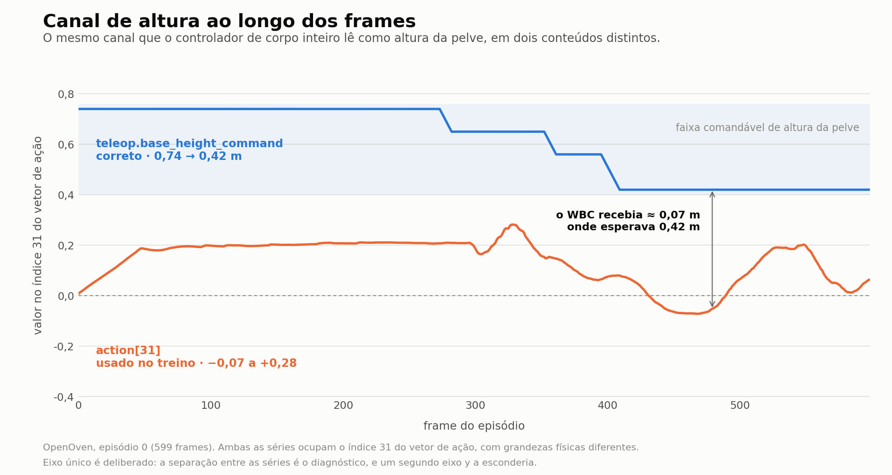
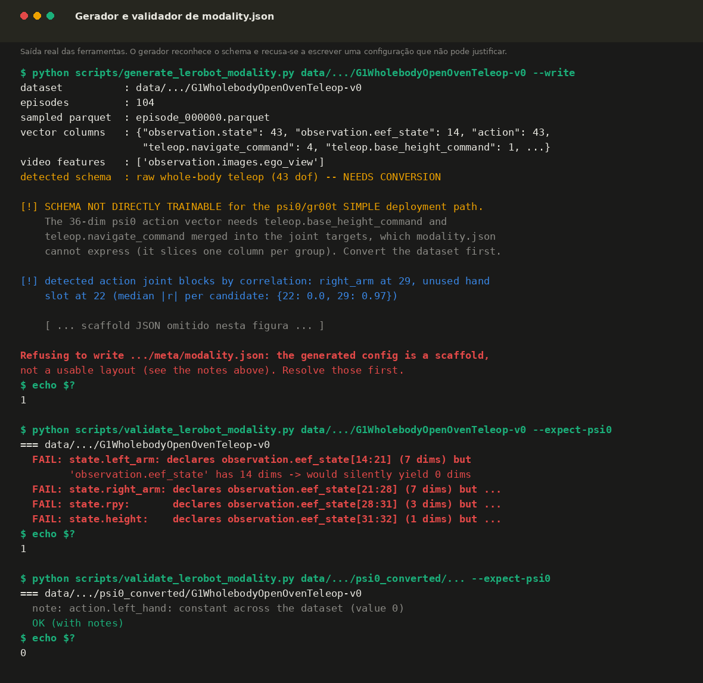

# Relatório técnico: falha de configuração de modality no fine-tuning do GR00T N1.7 em tarefas do SIMPLE

**Contexto:** card #11 (Treino e Teste do GR00T), sub-issues #13 (modality.json) e #14 (Adaptação do Psi0 ao GR00T 1.7)
**Repositório:** `AKCIT-RL/Psi0`, branch `dev/olives`
**Data da investigação:** 29 de julho de 2026
**Escopo:** diagnóstico da causa raiz do colapso postural observado em `G1WholebodyOpenOvenTeleop-v0` e `G1WholebodyHandoverTeleop-v0`, auditoria do subsistema de modality e correções aplicadas

---

## 1. Sumário executivo

O fine-tuning do GR00T N1.7 na tarefa `G1WholebodyLocomotionPickBetweenTablesTeleop-v0` atingiu 30% de taxa de sucesso no nível 0 de randomização, contra 0% do GR00T N1.6 na mesma tarefa. Ao estender o procedimento para outras tarefas do SIMPLE, o comportamento observado foi qualitativamente distinto: em vez de falhar na tarefa, o robô agachava progressivamente e colapsava, como se perdesse o equilíbrio. As curvas de treino não indicavam anomalia.

A investigação identificou que a causa não estava no modelo, nos hiperparâmetros ou no volume de dados, mas em uma incompatibilidade entre o arquivo `meta/modality.json` e as colunas efetivamente presentes no dataset. O canal de ação que o controlador de corpo inteiro interpreta como altura da pelve estava sendo alimentado, durante todo o treino, com o ângulo de uma junta do braço.

A falha atravessou o pipeline inteiro sem gerar uma única exceção. Foram identificadas e corrigidas as camadas que permitiram esse silêncio, além de outros nove defeitos encontrados durante a auditoria. Foram criadas duas ferramentas para eliminar a classe de erro na origem.

**Métrica central do diagnóstico**, medida sobre os 37.323 frames do dataset:

| Canal enviado ao WBC como `base_height_command` | Faixa | Grandeza física |
|---|---|---|
| O que o treino usava: `action[31]` | −0,361 a +0,417 | ângulo de junta do braço (rad) |
| O que deveria usar: `teleop.base_height_command` | 0,420 a 0,740 | altura da pelve (m) |

---

## 2. Observação inicial e formulação da hipótese

### 2.1 O contraste entre tarefas

O treino de `G1WholebodyLocomotionPickBetweenTablesTeleop-v0` produziu um modelo funcional (3/10). Os treinos de `G1WholebodyOpenOvenTeleop-v0` e `G1WholebodyHandoverTeleop-v0`, executados com o mesmo código, os mesmos hiperparâmetros e a mesma imagem de container, produziram modelos que derrubavam o robô.

Essa assimetria foi o ponto de partida metodológico. Um modelo subtreinado, sobreajustado ou com dados insuficientes falha **na tarefa**: erra o alvo, não fecha a mão, não alcança o objeto. Ele não perde o equilíbrio de forma sistemática. Perda de equilíbrio indica que os comandos enviados à camada de controle de baixo nível estão fora do domínio esperado por ela, o que aponta para o formato dos dados e não para a capacidade do modelo.

A investigação foi portanto direcionada ao pipeline de dados, e não ao ajuste de hiperparâmetros.

### 2.2 Isolamento

`G1WholebodyOpenOvenTeleop-v0` foi escolhida como caso de estudo por ser a tarefa com dataset completo disponível localmente (104 episódios) e por ter sido alvo do maior número de tentativas de treino registradas nos logs.

---

## 3. O contrato do `modality.json`

Para compreender a falha é necessário explicitar o papel desse arquivo, que não está documentado adequadamente no repositório upstream (observação já registrada no sub-issue #13).

### 3.1 Definição

`modality.json` mapeia cada grupo de estado e de ação para uma fatia de uma coluna do parquet:

```json
"height": { "start": 31, "end": 32, "original_key": "states" }
```

Esse arquivo é **o único lugar do pipeline onde o significado físico de cada dimensão é declarado**. Nenhum outro componente sabe que a dimensão 31 representa altura de pelve em metros e não um ângulo em radianos. Não há verificação de unidade, de faixa ou de semântica em nenhum ponto posterior.

### 3.2 A cadeia completa

```
modality.json          declara grupo -> (coluna, start, end)
        |
LeRobotEpisodeLoader   fatia as colunas do parquet por grupo
        |
StateActionProcessor   normaliza cada grupo com estatísticas fatiadas do mesmo modo
        |
Gr00tN1d7Processor     concatena os grupos e aplica padding até 132 dims
        |
        [ modelo ]
        |
decode_action          re-divide a saída em grupos pelas dimensões conhecidas
        |
gr00t_serve_simple     remonta o vetor psi0 de 36 dims, por nome de grupo
        |
agente do SIMPLE       encaminha as dimensões ao controlador de corpo inteiro
```

O elo final é direto e sem tradução intermediária, em `simple/baselines/*_decoupled_wbc.py`:

```python
navigate_cmd=pred_action[i][32:36],
base_height_command=pred_action[i][31:32],
```

O valor que sai do modelo na posição 31 vai literalmente para o comando de altura da pelve do WBC.

### 3.3 Invariantes necessários

Para que a cadeia esteja correta, quatro condições precisam valer simultaneamente:

1. As fatias declaradas precisam estar dentro dos limites das colunas reais.
2. As dimensões por grupo precisam coincidir entre treino e serving.
3. O significado físico de cada grupo precisa ser o mesmo dos dois lados.
4. As estatísticas de normalização precisam vir da mesma fatia da mesma coluna.

Antes desta investigação, o pipeline verificava apenas a existência dos nomes de coluna. Nenhum dos quatro invariantes era checado.

---

## 4. Diagnóstico

### 4.1 Os dois formatos de dataset

Os datasets utilizados estão em formatos distintos, produzidos por stacks de gravação diferentes:

| | PickBetweenTables | OpenOven |
|---|---|---|
| Origem | `psi-data/simple/` (já pós-processado) | `psi-data/simple-teleop/` (gravação crua) |
| Coluna de estado | `states`, 32 dims, formato psi0 | `observation.state`, 43 dims, juntas do corpo inteiro |
| | | `observation.eef_state`, 14 dims, poses de punho |
| Coluna de ação | `action`, 36 dims, formato psi0 | `action`, 43 dims, alvos de junta |
| Comando de altura | embutido em `action[31]` | coluna separada `teleop.base_height_command` |
| Comando de navegação | embutido em `action[32:36]` | coluna separada `teleop.navigate_command` |
| Chave de vídeo | `observation.images.egocentric` | `observation.images.ego_view` |
| Episódios / frames | 99 / 62.764 | 104 / 37.323 |

O dataset OpenOven preservava seu `meta/modality_bkp.json` original, descrevendo o layout cru de 43 graus de liberdade. Esse é o arquivo que a stack de gravação escreveu e que corresponde ao conteúdo real dos dados. O `modality.json` ativo, porém, descrevia o layout psi0, válido apenas para um dataset já convertido.

### 4.2 O que o treino efetivamente recebeu

Replicando o comportamento de `LeRobotEpisodeLoader.get_dataset_statistics()` sobre o dataset OpenOven com o `modality.json` que estava em uso:

```
state.left_hand    <- observation.eef_state[0:7]    dim=7   (pose do punho esquerdo, não a mão)
state.right_hand   <- observation.eef_state[7:14]   dim=7   (pose do punho direito, não a mão)
state.left_arm     <- observation.eef_state[14:21]  dim=0   VAZIO
state.right_arm    <- observation.eef_state[21:28]  dim=0   VAZIO
state.rpy          <- observation.eef_state[28:31]  dim=0   VAZIO
state.height       <- observation.eef_state[31:32]  dim=0   VAZIO

action.left_hand   <- action[0:7]     juntas da perna esquerda
action.right_hand  <- action[7:14]    resto das pernas
action.left_arm    <- action[14:21]   cintura + braço esquerdo
action.right_arm   <- action[21:28]   slot de mão, identicamente zero
action.rpy         <- action[28:31]   juntas do braço direito
action.height      <- action[31:32]   junta do braço direito
action.torso_vx    <- action[32:33]   junta do braço direito
action.torso_vy    <- action[33:34]   junta do braço direito
action.torso_vyaw  <- action[34:35]   junta do braço direito
action.target_yaw  <- action[35:36]   junta do braço direito
```

O vetor de estado efetivo tinha 14 dimensões (apenas as poses de punho) em vez das 32 esperadas. O vetor de ação tinha 36 dimensões corretas em contagem, mas cada uma carregando uma grandeza não relacionada ao nome do grupo.

### 4.3 Consequência física

Medido sobre os 37.323 frames:

```
action.height (encaminhado ao WBC como base_height_command)
  usado no treino : action[31]                     min=-0,361  max=+0,417   mean=+0,068
  correto         : teleop.base_height_command     min= 0,420  max= 0,740   mean= 0,713

action.torso_vx / vy / vyaw / target_yaw (encaminhados como navigate_cmd)
  usado no treino : action[32:36]   min=[-0,154, -1,270, -0,378, -1,201]
                                    max=[ 0,608,  0,555,  1,143,  0,833]
  correto         : teleop.navigate_command
                                    min=[-0,500, -0,467, -0,210, 0,000]
                                    max=[ 0,500,  0,500,  0,334, 0,000]
```



*Figura 3 — Evidência quantitativa da troca de canal, no episódio 0 do OpenOven. A série azul é o comando real de altura da pelve, que desce de 0,74 m para 0,42 m quando o operador agacha para abrir o forno. A série laranja é o que ocupava o mesmo índice 31 durante o treino. A separação entre as duas é a explicação direta do colapso postural.*

A política aprendeu a emitir, no canal de altura, valores em torno de 0,07. O WBC recebeu isso como uma instrução para posicionar a pelve a aproximadamente 7 cm do solo. Simultaneamente, o comando de navegação recebia ângulos de junta com magnitude acima de 1,2, interpretados como velocidades de base.

O robô não estava falhando. Estava reproduzindo fielmente o que lhe foi ensinado a produzir. O agachamento seguido de colapso é a resposta correta do controlador a comandos incorretos.

---

## 5. Por que a falha permaneceu silenciosa

Esta seção é a mais relevante do relatório, porque explica por que o defeito consumiu múltiplas execuções de treino antes de ser identificado.

### 5.1 A sequência de erros conduziu à configuração incorreta

O `modality.json` do OpenOven foi obtido partindo do arquivo do PickBetweenTables e ajustando-o até que o pipeline parasse de emitir erros. Esse é o procedimento correto de depuração. O problema é que o pipeline recompensou esse procedimento com uma configuração que executa e está errada.

A sequência foi reproduzida experimentalmente:

**Passo 1.** Aplicando o `modality.json` do PickBetweenTables diretamente ao dataset OpenOven, o carregamento falha imediatamente, com erros explícitos e informativos:

- a coluna `states` não existe no dataset OpenOven;
- a chave de vídeo `observation.images.egocentric` não consta em `info.json` (o dataset usa `observation.images.ego_view`).

**Passo 2.** Corrigindo a chave de vídeo para `observation.images.ego_view` e reapontando os grupos de estado para uma coluna existente, os erros cessam. A partir desse ponto não há nenhum sinal de que as fatias passaram a incidir sobre grandezas não relacionadas.

O resultado depende de qual coluna existente é escolhida:

```
original_key = observation.eef_state  (14 dims)
  -> fatias fora do intervalo, grupos colapsam para 0 dims, nenhum erro

original_key = observation.state      (43 dims)
  -> todas as fatias dentro do intervalo, dimensões resultam 7, 7, 7, 7, 3, 1, nenhum erro
```

O segundo caso é o mais grave. As dimensões são exatamente as que uma configuração correta produziria, de modo que a configuração parece íntegra sob qualquer verificação estrutural disponível ao código, enquanto lê pernas e mãos como se fossem braços e torso. Nenhuma checagem de forma consegue distinguir esse caso de um acerto.

### 5.2 Camadas permissivas do pipeline

Três propriedades independentes permitiram que a configuração incorreta atravessasse um treino completo:

**Truncamento silencioso do NumPy.** Fatias fora do intervalo são truncadas em vez de gerarem exceção. Em `LeRobotEpisodeLoader._extract_joint_groups`, a operação `x[start_idx:end_idx]` sobre um vetor de 14 dimensões com `start=28, end=31` retorna um array vazio, sem aviso.

**Tolerância do normalizador ao caso degenerado.** O comportamento de `normalize_values_minmax` foi testado sistematicamente para divergências de dimensão entre o que o servidor fornece e o que o treino normalizou:

| dim servida | dim treinada | resultado |
|---|---|---|
| 7 | 7 | correto |
| 7 | 3 | `IndexError` |
| 3 | 7 | `IndexError` |
| 7 | 14 | `IndexError` |
| 7 | **0** | **silencioso, retorna zeros** |

O único caso silencioso é exatamente o produzido por fatia fora do intervalo. Isso ocorre porque uma máscara booleana de comprimento zero aplicada a um eixo de qualquer comprimento é aceita pelo NumPy 1.26.4 sem erro.

**Indiferença da função de perda.** O objetivo de treino estava perfeitamente bem definido. O modelo aprendia um mapeamento consistente, apenas o mapeamento errado. A perda caiu de 0,7736 para 0,0289 ao longo de 50.000 passos, sem qualquer indicação de anomalia.

### 5.3 Ausência de sinal de validação

Verificou-se adicionalmente que a avaliação periódica configurada (`--eval-strategy steps --eval-steps 1000 --val-split 0.1`) **não produz métrica alguma**. Em ambas as execuções analisadas, apenas `eval_runtime`, `eval_samples_per_second` e `eval_steps_per_second` foram emitidos. Nenhum `eval_loss`.

A causa é determinística:

```
assinatura de Gr00tN1d7.forward : ['self', 'inputs']
transformers.can_return_loss()  : False
transformers.find_labels()      : []
```

O `Trainer` do HuggingFace decide se deve acumular perda na validação inspecionando a assinatura do `forward` em busca de `labels` ou `return_loss`. Como `Gr00tN1d7.forward(self, inputs)` não possui nenhum dos dois, o laço de avaliação executa os 2.544 exemplos de validação sem nunca acumular a perda.

Consequência: o custo é de aproximadamente 89 segundos por avaliação, 50 avaliações por treino, totalizando cerca de 74 minutos de GPU, além de 10% dos episódios retidos fora do treino, sem qualquer retorno. Não há sinal para detectar sobreajuste nem para comparar checkpoints offline.

---

## 6. Por que `PickBetweenTables` foi imune

Esta é a peça que fecha o diagnóstico e a que mais importa para a interpretação de resultados anteriores.

Medido sobre os 99 episódios e 62.764 frames do dataset:

```
state.height   min=0,7400  max=0,7400  std=0,0000
action.height  min=0,7400  max=0,7400  std=0,0000
```

A altura da pelve é **constante** em toda a base. A tarefa nunca agacha.

Um canal constante é matematicamente impossível de errar no pipeline: `q01 == q99` faz a máscara de normalização desligar, o valor normalizado fica em 0, e a desnormalização reconstrói exatamente 0,74. Independentemente do que o modelo preveja nessa dimensão, a saída é o valor correto.

Adicionalmente, esse dataset já estava no formato psi0, de modo que seu `modality.json` correspondia às colunas reais.

**Interpretação:** o resultado de 30% em PickBetweenTables não constituía evidência de que o pipeline estivesse correto. Era a única tarefa que jamais exercita o canal capaz de desestabilizar o robô. Qualquer tarefa que exija variação de altura da pelve estava exposta ao defeito.

---

## 7. Achados adicionais da auditoria

A auditoria completa do subsistema de modality revelou defeitos independentes da causa raiz.

### 7.1 Ordenações de juntas divergentes no mesmo dataset

Ao desenvolver o conversor, constatou-se que as duas colunas de 43 dimensões do dataset cru **não compartilham a mesma ordenação de juntas**. A verificação foi feita correlacionando `action[t]` contra `state[t+5]` sobre 15 episódios:

```
action[15:22] -> state[15:22]   braço esquerdo    r = 0,95 a 0,99
action[22:29] -> constante zero                   (slot de mão esquerda, nunca comandado)
action[29:36] -> state[22:29]   braço direito     r = 0,95 a 0,99
action[36:43] -> state[36:43]   mão direita       r = 0,96
```

Ou seja:

```
observation.state : pernas 0:12 | cintura 12:15 | braço_e 15:22 | braço_d 22:29 | mão_e 29:36 | mão_d 36:43
action            : pernas 0:12 | cintura 12:15 | braço_e 15:22 | mão_e 22:29  | braço_d 29:36 | mão_d 36:43
```

**Implicação:** o conversor existente `postprocess_psi0.py` lê `action[22:29]` como braço direito. Nesse schema, essa faixa é o slot de mão esquerda, identicamente zero. O conversor teria escrito zeros no braço direito mesmo se as colunas de origem que ele espera existissem.

### 7.2 Bug de reversão temporal no conversor existente

Em `postprocess_psi0.py`, a construção do `state.rpy` usava:

```python
history_cmd[:to, 3:6][::-1]     # inverte o eixo do TEMPO
```

A intenção era inverter o eixo de **canais** (yaw, pitch, roll para roll, pitch, yaw), como a própria função faz corretamente em `build_proprio_obs` com `[:, ::-1]`. Da forma escrita, o sinal `state.rpy` seria gravado em ordem temporal invertida. O dataset PickBetweenTables baixado do HuggingFace não apresenta esse defeito, tendo sido gerado por outra versão do script, mas o bug está presente no código atual.

### 7.3 Faixa efetiva de comando reduzida por normalização percentil

Com `use_percentiles=True` (herdado do checkpoint base), a desnormalização mapeia `[-1, 1]` para `[q01, q99]`, com saturação. A política **não consegue emitir valores fora dessa faixa**:

| canal | faixa dos dados | faixa emitível | redução |
|---|---|---|---|
| `height` | 0,420 a 0,740 | 0,490 a 0,740 | 21,9% |
| `torso_vyaw` | −0,466 a 0,569 | −0,144 a 0,161 | 70,5% |
| `right_arm[5]` | −0,419 a 1,143 | −0,306 a 0,254 | 64,2% |
| `torso_vy` | −0,467 a 0,500 | −0,053 a 0,444 | 48,6% |

Verificou-se se isso compromete a tarefa OpenOven: apenas 355 frames (0,95%) e 2 dos 104 episódios descem abaixo de 0,49 m. O corte está removendo comportamento atípico, que é a finalidade da normalização por percentil. **Não constitui defeito**, mas é uma propriedade relevante: a faixa comandável não corresponde à faixa presente nos dados.

### 7.4 Duas implementações paralelas de normalização, uma inoperante

O repositório contém dois caminhos de processamento de modality. O legado, da era N1.6, está quebrado:

```
gr00t.model.transforms        ImportError: cannot import name 'EMBODIMENT_TAG_MAPPING'
gr00t.experiment.runner       ImportError: cannot import name 'LeRobotMixtureDataset'
gr00t.experiment.data_config  ImportError: cannot import name 'ModalityConfig'
```

Como consequência, todo o pacote `gr00t/data/transform/` é inalcançável, incluindo a classe `Normalizer`, cuja semântica para dimensões degeneradas **difere** da implementação viva. O caminho efetivo do N1.7 é `StateActionProcessor` com `data/utils.py`.

Trata-se de código sem impacto em execução, mas com alto potencial de induzir erro em manutenção. Foi o arquivo que conduziu a uma conclusão incorreta na primeira iteração desta própria análise.

### 7.5 Defeitos no servidor de inferência

**Tratamento de exceção mascarando falhas.** O manipulador retornava HTTP 200 com um dicionário de status para qualquer exceção, fazendo com que falhas de inferência se apresentassem como respostas bem-sucedidas ao cliente.

**Uso de `or` sobre array NumPy.** Em `_action_to_psi_format`:

```python
raw = action.get(key) or action.get(f"action.{key}")
```

`or` avalia `bool()` sobre o primeiro operando, o que gera `ValueError` para qualquer chunk de ação real. O caminho permanecia dormente apenas porque o `Gr00tSimPolicyWrapper` prefixa suas chaves de saída com `action.`, fazendo a primeira busca retornar `None`. Com o wrapper desabilitado, o servidor falharia em toda inferência.

**Divergência semântica entre ramos de entrada de estado.** O servidor aceita dois formatos de observação, que definem `state.rpy` de maneiras diferentes:

| ramo | fonte de `state.rpy` | compatível com o treino |
|---|---|---|
| `states` (cliente SIMPLE) | último rpy **comandado** | sim |
| `proprio_joint_positions` + `amo_policy_command` | ângulo **medido** da cintura | não |

O treino define `state.rpy` como o comando anterior. O segundo ramo, destinado a deployment em robô real, fornecia a posição medida da junta, grandeza distinta.

**Código morto com asserção incorreta.** O método `Gr00tN1d7Processor.process_observation` (aproximadamente 100 linhas) não é invocado por nenhum componente. Contém `assert normalized_states.shape[1] <= max_state_dim`, verificando o eixo temporal em vez do eixo de dimensões.

### 7.6 Realimentação de estado congelada nos agentes do SIMPLE

Independente da questão de dataset, os agentes `_decoupled_wbc` definiam `_last_cmd_torso_rpyh` no reset e nunca o atualizavam durante o episódio:

```python
self._last_cmd_torso_rpyh = np.array([0, 0, 0, 0.74])  # definido no reset, nunca atualizado
```

Como o treino define `state.rpy` e `state.height` como a pose de torso comandada no passo anterior, a política recebia, durante todo o rollout, a informação de que estava em pé a 0,74 m, mesmo enquanto agachava. Isso caracteriza uma divergência entre malha fechada no treino e malha aberta na inferência, precisamente nos canais que controlam a postura.

Os agentes não-desacoplados (`psi0.py`, `gr00t_n16.py`, `act_g1.py`, `dp_g1.py`, `intervla_m1_g1.py`, `pi05.py`) já realizavam essa atualização, o que caracteriza omissão na cópia dos arquivos para as variantes desacopladas. Permanecem afetados: `act_decoupled_wbc.py`, `dp_decoupled_wbc.py` e `intervla_decoupled_wbc.py`.

### 7.7 Colunas escalares no formato LeRobot

O LeRobot grava features de shape `[1]` como escalares no parquet, não como arrays de um elemento. `teleop.base_height_command` é um exemplo. O `LeRobotEpisodeLoader` trata esse caso (colunas não-ndarray contornam o fatiamento), mas qualquer ferramenta de inspeção construída sobre a suposição de arrays perde essas colunas silenciosamente.

### 7.8 Nota sobre o índice de projetor

O tag `g1_loco_downstream` é mapeado ao índice de projetor 25 em `EMBODIMENT_TAG_TO_PROJECTOR_INDEX`, compartilhado com `real_g1_relative_eef_relative_joints` e `unitree_g1_full_body_with_waist_height_nav_cmd`. Trata-se de escolha deliberada (reaproveitar o projetor pré-treinado mais próximo), documentada no código. Não constitui defeito, mas implica que o MLP condicionado ao embodiment parte de um prior treinado para uma semântica de ação distinta.

---

## 8. Correções implementadas

### 8.1 Conversor para o schema de teleoperação com WBC desacoplado

Arquivo: `third_party/SIMPLE/scripts/postprocess_psi0_teleop_wbc.py`

O conversor existente `postprocess_psi0.py` não é aplicável a este schema, pois lê colunas (`observation.joint_qpos`, `observation.amo_policy_command`, `observation.amo_policy_target_yaw`, `observation.amo_policy_turning_flag`) que a stack de gravação atual não produz.

Mapeamento implementado, com todas as origens verificadas contra `replay_decoupled_agent.py`, que lê exatamente as mesmas colunas para alimentar o WBC durante replay:

```
action[0:7]    left_hand   <- action[22:25] + action[27:29] + action[25:27]   (polegar, médio, indicador)
action[7:14]   right_hand  <- action[36:43]
action[14:21]  left_arm    <- action[15:22]
action[21:28]  right_arm   <- action[29:36]      (ordenação verificada por correlação)
action[28:31]  rpy         <- action[13:15] + action[12:13]   (roll, pitch, yaw da cintura)
action[31:32]  height      <- teleop.base_height_command
action[32:36]  nav         <- teleop.navigate_command[0:4]

state[28:31]   rpy         <- rpy comandado no passo anterior
state[31:32]   height      <- teleop.base_height_command do passo anterior
```

O script verifica a ordenação de juntas por correlação em tempo de execução e recusa-se a prosseguir caso a suposição não se confirme.

### 8.2 Falha explícita no carregador

`LeRobotEpisodeLoader` passa a levantar exceção em vez de produzir grupos vazios:

```
ValueError: modality.json declares state.left_arm = observation.eef_state[14:21]
(7 dims), but 'observation.eef_state' has only 14 dims. The slice would silently
yield 0 dims. modality.json does not match this dataset.
```

A verificação foi aplicada tanto no fatiamento dos dados quanto no fatiamento das estatísticas, além de checagem de existência de coluna e de consistência com `stats.json`.

**Limitação declarada:** essa correção fecha o primeiro dos dois casos silenciosos descritos em 5.1. Não fecha o segundo, em que as fatias incidem sobre uma coluna suficientemente grande porém semanticamente não relacionada. Do ponto de vista do código, essa configuração é indistinguível de uma correta.

### 8.3 Ferramentas para `modality.json`

Endereçam diretamente o sub-issue #13.

**`scripts/validate_lerobot_modality.py`** verifica um arquivo existente contra os dados reais: limites das fatias, existência das colunas, consistência de `stats.json`, existência das chaves de vídeo e anotação, e sinaliza canais de ação constantes. É uma verificação **estrutural**, com a limitação declarada acima.

**`scripts/generate_lerobot_modality.py`** atua na direção oposta: em vez de validar um arquivo escrito por alguém, deriva um a partir do dataset.

Princípio de projeto adotado: dimensões, nomes de coluna e chaves de vídeo são lidos dos dados e são confiáveis. Semântica física não pode ser lida de um parquet, pois reside na definição do robô. O gerador portanto atribui semântica somente quando reconhece positivamente um schema conhecido, e emite um scaffold com TODOs explícitos caso contrário. Recusa-se a escrever um arquivo que não possa justificar integralmente.

Comportamento verificado nos três casos disponíveis:

| dataset | detecção | ação |
|---|---|---|
| psi0 convertido | `psi0 (states=32, action=36)` | gera arquivo idêntico ao de referência |
| teleop cru 43-dof | `raw whole-body, NEEDS CONVERSION` | recusa escrever, aponta o conversor |
| schema desconhecido | scaffold com TODOs | recusa escrever |

O gerador redescobre autonomamente a ordenação de juntas descrita em 7.1, reportando `right_arm at 29, mediana |r| = 0,97` contra `0,0` para a alternativa.



*Figura 4 — Saída real das duas ferramentas. O gerador reconhece o schema cru, explica por que ele não é diretamente treinável, redescobre a ordenação de juntas por correlação e recusa-se a escrever o arquivo, encerrando com código 1. O validador reprova o dataset com o `modality.json` incorreto e aprova o convertido. As três verificações somam poucos segundos, contra nove horas de treino seguidas de execução em simulador.*

### 8.4 Realimentação de estado nos agentes do SIMPLE

Implementada seguindo a referência dos agentes não-desacoplados, isto é, atualização por ação executada e não por chunk, em `gr00t_n16_decoupled_wbc.py` e `psi0_decoupled_wbc.py`. O segundo foi corrigido para que comparações entre GR00T e Psi0 utilizem harness idêntico.

### 8.5 Blindagem do servidor de inferência

- Tratamento de exceção retorna HTTP 500 com tipo e detalhe do erro, além de traceback no log.
- `_pick` reescrito com verificação explícita de `None`, removendo a dependência oculta do wrapper.
- Ramo `proprio/amo_policy` alinhado à semântica de comando anterior para `rpy`, conforme `build_proprio_obs`.

### 8.6 Marcação do código legado

Os três módulos inoperantes e `data/transform/state_action.py` receberam cabeçalho explicativo indicando o erro exato de importação e o caminho vivo do N1.7.

**Decisão registrada:** optou-se por marcar em vez de remover, uma vez que `src/gr00t` é cópia vendorizada do upstream da NVIDIA e a remoção de arquivos complicaria merges futuros. Como os módulos já falham na importação, o risco residual é exclusivamente de leitura, que a marcação endereça.

### 8.7 Correção do bug de reversão temporal

`postprocess_psi0.py` corrigido de `[::-1]` para `[:, ::-1]`, com comentário explicativo.

---

## 9. Validação

### 9.1 Dataset convertido

Conversão de 104 episódios e 37.323 frames, quantidade idêntica à origem.

```
action.height   antes: -0,361 a +0,417   depois: 0,420 a 0,740
state.height[t] == action.height[t-1]    diferença máxima: 0,0
dimensões de estado   antes: 7, 7, 0, 0, 0, 0   depois: 7, 7, 7, 7, 3, 1
NaN / Inf: ausentes
```

### 9.2 Teste ponta a ponta com o carregador real

```
dataset quebrado    -> ValueError com mensagem diagnóstica completa
dataset convertido  -> carrega, 16 grupos com dimensões corretas, action.height 0,42 a 0,74
PickBetweenTables   -> carrega normalmente (sem regressão)
```

### 9.3 Verificação do checkpoint

Estatísticas gravadas em `checkpoint-10000` confirmam procedência do dataset convertido:

```
embodiment g1_loco_downstream presente
action.height  min=[0,42]  max=[0,74]
state.left_arm dim=7, state.right_arm dim=7, state.rpy dim=3, state.height dim=1
model_type = Gr00tN1d7, backbone = nvidia/Cosmos-Reason2-2B
```

---

## 10. Resultados

### 10.1 Avaliação

`G1WholebodyOpenOvenTeleop-v0`, nível 0, `checkpoint-10000` (20% do cronograma de 50.000 passos): **1/10**.

A taxa não é interpretável nesse estágio. O checkpoint encontra-se no início do decaimento da taxa de aprendizado, e a execução anterior que atingiu 30% em PickBetweenTables utilizou o checkpoint de 50.000 passos.

A mudança relevante é qualitativa: o robô passa a executar movimento coerente com a tarefa, em vez de agachar e colapsar.

### 10.2 Desempenho de treino observado

Medições da RTX 4090 utilizada:

```
throughput            1,65 a 1,70 it/s
primeiro eval         ~12 minutos (passo 1.000)
primeiro checkpoint   ~1h55min (passo 10.000)
treino completo       9h35min (50.000 passos)
custo de avaliação    89 s por avaliação, ~74 min no total
```

---

## 11. Limitações e ressalvas

1. **As duas correções principais entraram simultaneamente.** A conversão do dataset e a realimentação de estado foram aplicadas antes da mesma avaliação. O resultado não isola a contribuição individual de cada uma. Para separá-las seria necessária uma avaliação adicional com `psi0_decoupled_wbc.py` revertido.

2. **Checkpoint precoce.** O resultado de 1/10 corresponde a 20% do cronograma e não é comparável aos números de 50.000 passos reportados anteriormente.

3. **Ramo `proprio/amo_policy` não validado ponta a ponta.** A correção semântica do `rpy` nesse ramo foi verificada isoladamente e contra a referência do conversor, mas o ramo não é exercitado pelo fluxo do SIMPLE. A mudança só se manifesta em deployment com robô real.

4. **Escopo de datasets verificado.** A análise confirmou o defeito em `G1WholebodyOpenOvenTeleop-v0`. `G1WholebodyHandoverTeleop-v0` apresentou o mesmo comportamento e presumivelmente a mesma causa, mas seu dataset não estava disponível localmente para verificação direta.

5. **Correções não commitadas no repositório.** Há uma correção anterior não commitada em `sharded_mixture_dataset.py` (guarda contra worker sem shards atribuídos), datada de 14 de junho, que resolve um `IndexError` no primeiro eval. Um `git checkout` desse arquivo reintroduziria a falha.

---

## 12. Recomendações

### 12.1 Imediatas

1. Aplicar o fluxo de conversão e validação aos demais datasets provenientes da stack de gravação crua, antes de considerar seus resultados:

```bash
python third_party/SIMPLE/scripts/postprocess_psi0_teleop_wbc.py --sim-root <dataset> --out-dir <convertido>
python scripts/generate_lerobot_modality.py <convertido>
python scripts/validate_lerobot_modality.py <convertido> --expect-psi0
```

2. Concluir o treino de OpenOven até 50.000 passos e reavaliar, para obter número comparável ao de PickBetweenTables.

3. Commitar as correções, incluindo a de `sharded_mixture_dataset.py`.

### 12.2 De médio prazo

4. **Decidir sobre a avaliação periódica.** Nas condições atuais ela consome cerca de 74 minutos de GPU e retém 10% dos episódios sem produzir métrica. As opções são desabilitá-la (`--eval-strategy no --val-split 0.0`), recuperando tempo e dados, ou corrigir a exposição da perda ao `Trainer`, obtendo curva de validação. A segunda opção é a mais útil, e é pré-requisito para a discussão de sobreajuste registrada em #15.

5. Estender a correção de realimentação de estado aos agentes `act_decoupled_wbc`, `dp_decoupled_wbc` e `intervla_decoupled_wbc`, para que comparações entre baselines utilizem harness idêntico.

6. Avaliar a remoção efetiva dos módulos legados inoperantes, caso se decida divergir do upstream.

---

## 13. Conclusão

O defeito investigado não decorreu de erro de configuração isolado, mas de uma característica sistêmica do pipeline: as verificações estavam concentradas naquilo que já é visível ao operador, isto é, nomes de coluna, e ausentes em tudo o que não é, isto é, limites de fatia, coerência dimensional, semântica física e integridade da resposta do servidor.

A consequência prática é que o único feedback disponível durante a depuração apontava na direção errada. Corrigir os nomes até que os erros cessassem produzia uma configuração executável e incorreta, e nenhuma etapa posterior, incluindo a curva de perda e a avaliação periódica, era capaz de contradizê-la.

O resultado de 30% obtido em `PickBetweenTables` não validava o pipeline. Aquela tarefa é a única entre as avaliadas cujo canal de altura é constante, o que a torna estruturalmente imune ao defeito. Essa observação recomenda cautela na generalização de resultados positivos obtidos em uma única tarefa, especialmente quando ela não exercita todos os canais de atuação.

As correções aplicadas visam menos este dataset específico e mais reduzir o tempo de detecção da próxima incompatibilidade, de nove horas de treino seguidas de execução em simulador para alguns segundos de verificação.

---

## Anexo A: arquivos criados e modificados

**Criados**

| Arquivo | Função |
|---|---|
| `scripts/generate_lerobot_modality.py` | Deriva `modality.json` a partir do dataset |
| `scripts/validate_lerobot_modality.py` | Valida `modality.json` contra os dados |
| `third_party/SIMPLE/scripts/postprocess_psi0_teleop_wbc.py` | Conversor do schema de teleoperação com WBC desacoplado |

**Modificados**

| Arquivo | Alteração |
|---|---|
| `src/gr00t/gr00t/data/dataset/lerobot_episode_loader.py` | Falha explícita em incompatibilidade de layout |
| `src/gr00t/gr00t/deploy/gr00t_serve_simple.py` | HTTP 500, correção de `_pick`, semântica de `rpy` |
| `third_party/SIMPLE/src/simple/baselines/gr00t_n16_decoupled_wbc.py` | Realimentação de estado do torso |
| `third_party/SIMPLE/src/simple/baselines/psi0_decoupled_wbc.py` | Realimentação de estado do torso |
| `third_party/SIMPLE/scripts/postprocess_psi0.py` | Correção da reversão temporal |
| `src/gr00t/gr00t/model/transforms.py` | Marcação de código inoperante |
| `src/gr00t/gr00t/experiment/runner.py` | Marcação de código inoperante |
| `src/gr00t/gr00t/experiment/data_config.py` | Marcação de código inoperante |
| `src/gr00t/gr00t/data/transform/state_action.py` | Marcação de código não utilizado |

## Anexo B: comandos de reprodução

```bash
# Conversão
python third_party/SIMPLE/scripts/postprocess_psi0_teleop_wbc.py \
  --sim-root data/simple_teleop_g1/simple/G1WholebodyOpenOvenTeleop-v0/G1WholebodyOpenOvenTeleop-v0 \
  --out-dir  data/simple_teleop_g1/simple/psi0_converted/G1WholebodyOpenOvenTeleop-v0

# Verificação
python scripts/validate_lerobot_modality.py <dataset> --expect-psi0

# Treino
DATASET_PATH=<convertido> ./train_gr00t.sh

# Serving
docker run --rm --gpus all --network=host --env-file src/gr00t/.env \
  -v $(pwd):/workspace -e PYTHONPATH="/workspace/src:/workspace/src/gr00t" \
  gr00t-train /opt/venv/bin/python -m gr00t.deploy.gr00t_serve_simple \
    --host 0.0.0.0 --port 5556 --device cuda:0 --use-sim-policy-wrapper --strict \
    --model-path /workspace/checkpoints/<run>/checkpoint-10000 \
    --embodiment-tag G1_LOCO_DOWNSTREAM

# Avaliação
cd third_party/SIMPLE && DATA_DIR=$(pwd)/data docker compose run --rm --entrypoint "" \
  --volume "$(pwd)/src:/workspace/SIMPLE/src" sim bash -c \
  "cd /workspace/SIMPLE && source .venv/bin/activate && \
   python -m simple.cli.eval_decoupled_wbc simple/G1WholebodyOpenOvenTeleop-v0 \
   gr00t_n16_decoupled_wbc level-0 --data-format lerobot \
   --data-dir data/evals/simple-eval/G1WholebodyOpenOvenTeleop-v0/level-0 \
   --host localhost --port 5556 --headless --num-episodes 10"
```
